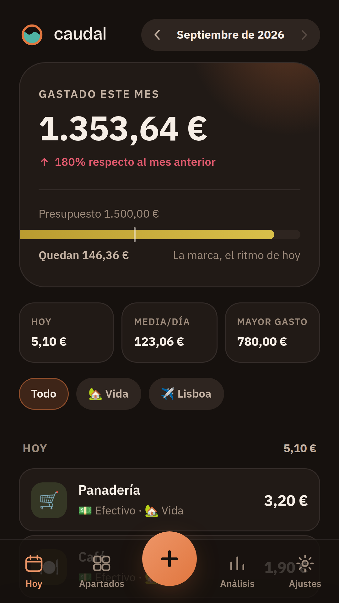
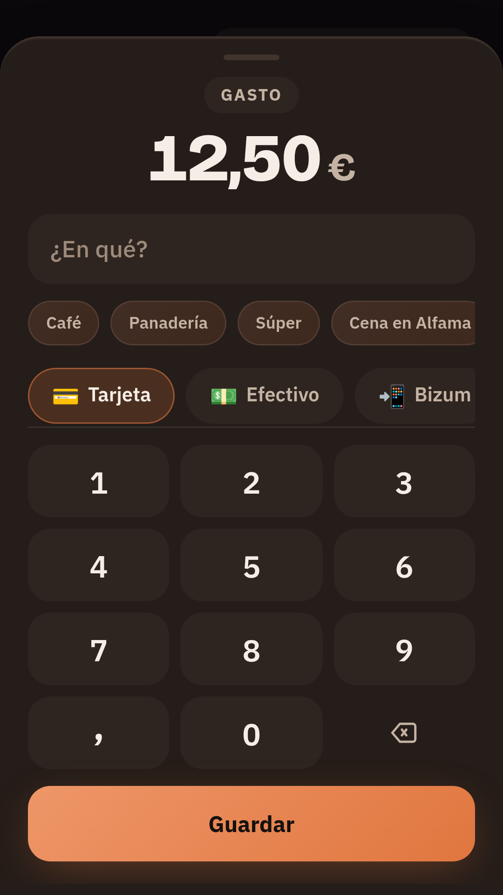
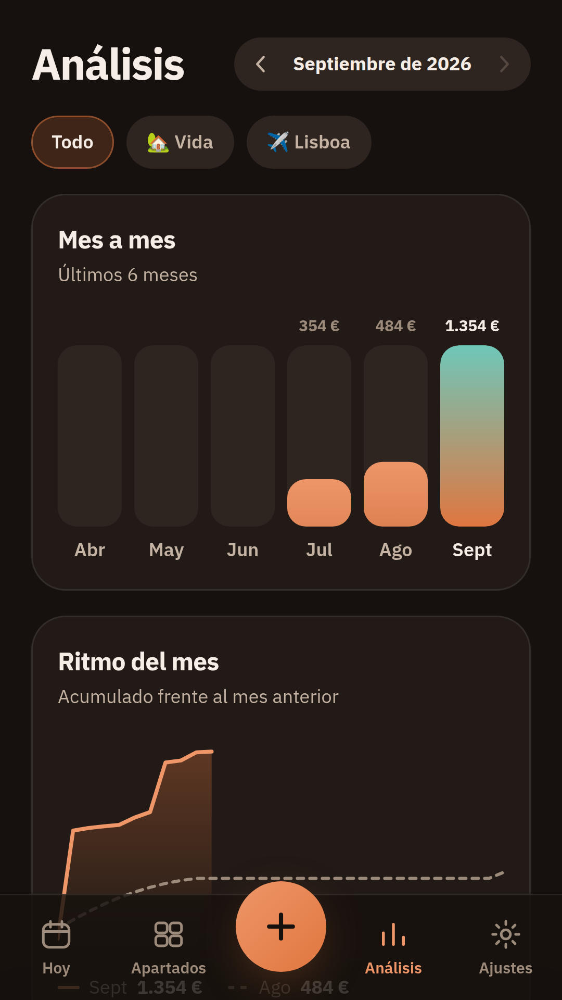
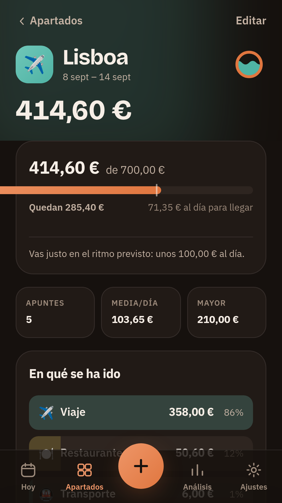

<div align="center">


# Caudal

**Tu dinero, en movimiento.**

Control de gastos personales desde el móvil. Apunta en segundos, separa por
apartados y mira a dónde va tu dinero.

</div>

---

## Qué es

Una aplicación web instalable (PWA) para llevar las cuentas del día a día. Todo
ocurre en el móvil: no hay cuenta que crear, no hay servidor, no hay nadie
mirando tus gastos. Los datos viven en el navegador del teléfono y funcionan
sin conexión.

| | |
|---|---|
|  |  |
|  |  |

### Apuntar un gasto: importe, método y concepto

La fecha se pone sola y la categoría se adivina del concepto («Mercadona» →
Súper, «metro» → Transporte). El método viene preseleccionado según lo que más
uses en ese apartado, y los conceptos recientes están a un toque. El objetivo
es apuntar un café en menos de cinco segundos sin hacer scroll.

### Apartados: cada cosa por su lado

Un apartado es un trozo de tu vida con cuenta propia: el día a día, un viaje a
Lisboa, la reforma del baño. Los de viaje admiten presupuesto y fechas, y
mientras el viaje está en curso los gastos van ahí sin que tengas que elegirlo.
Cada apartado tiene su propio panel con su ritmo de gasto y sus gráficas.

### Análisis

Seis módulos, cada uno respondiendo a una pregunta concreta: ¿voy a más o a
menos? (mes a mes y acumulado contra el mes anterior), ¿en qué se me va?
(categorías), ¿qué días gasto? (mapa de calor), ¿cómo pago? (métodos) y ¿cómo
se reparte entre apartados?

## Empezar

```bash
npm install
npm run dev        # http://localhost:5173
```

| Comando | Qué hace |
|---|---|
| `npm run dev` | Servidor de desarrollo |
| `npm run build` | Comprueba tipos y compila a `dist/` |
| `npm test` | Pruebas del núcleo (dinero, fechas, analítica, Norma 43, captura) |
| `npm run verify` | Verificación de extremo a extremo sobre la app compilada |
| `npm run pack` | Compila y empaqueta `caudal.tar.gz` para subir al hosting |
| `npm run icons` | Regenera los iconos desde el SVG de la marca |
| `npm run fonts` | Vuelve a descargar las fuentes a `public/fonts` |

Requiere Node 22.12 o superior (lo exige Vite 8).

## Volcar los pagos con tarjeta

La pregunta de siempre, con la respuesta honesta:

**Lo que no se puede.** Una página web no puede enterarse de que has acercado
la tarjeta al datáfono. El pago lo ejecuta el chip seguro del móvil o la propia
tarjeta, y ningún programa ajeno —web o nativo— puede observarlo. Si pagas con
la tarjeta física, el teléfono ni se entera. La Web NFC API sólo lee etiquetas
NDEF y deja fuera explícitamente las tarjetas EMV; FinanceKit de Apple es sólo
para apps nativas de Estados Unidos y Reino Unido.

**Lo que sí se puede.** Tu banco te manda un aviso por cada cargo, y una
automatización del propio teléfono puede leerlo y abrir Caudal con los datos:

- **iPhone** — Atajos › Automatización › disparador **Cartera**, acción **Abrir
  URL** (no «Obtener contenido de la URL»: eso sale a internet y no llega a la
  app) apuntando a `/add?importe=…&concepto=…&auto=1`.
- **Android** — MacroDroid o Tasker con el disparador **Notificación
  recibida**, filtrado por tu banco, y la acción **Abrir sitio web** a la misma
  dirección. Android además permite compartir el aviso directamente a la app.

Caudal detecta los duplicados: si el mismo movimiento llega dos veces, o ya lo
habías apuntado a mano, te lo dice en vez de sumarlo otra vez.

**Lo que lo cubre todo.** Las automatizaciones sólo ven lo que el banco avisa,
y en iPhone únicamente los pagos con Apple Pay en tienda. Para no dejarte nada,
descarga el extracto en formato **Norma 43** desde la web de tu banco e
impórtalo desde Ajustes: un par de toques al mes, con vista previa y sin
duplicar.

Los detalles, incluidas las opciones de open banking que requerirían un
servidor, están en [`docs/ARQUITECTURA.md`](docs/ARQUITECTURA.md).

## Cómo está hecho

React 19 · TypeScript 7 · Vite 8 · Dexie sobre IndexedDB · sin framework de
estilos y sin librería de gráficas.

**Tinta y barro.** El lienzo es negro cálido, no negro azulado: casi toda
interfaz oscura de hoy tira al azul-violeta y ese parecido es lo que las hace
indistinguibles. El color de acción es barro cocido y el acento verde agua —la
vasija y el caudal que lleva dentro, que es justo lo que dibuja el logo—. El
tema claro está compuesto aparte, no invertido: es el mismo mundo a la luz del
día, con el barro oscurecido hasta que el texto blanco se lee encima.

Con una marca cálida, el rojo de «te has pasado» se le pega. Por eso el peligro
se empujó a un rojo frío y el aviso al oro: los tres quedan a 29° de tono unos
de otros. Todos los valores están calculados, y `src/styles/__tests__` verifica
en cada ejecución que los dos temas cumplen WCAG AA y que ningún componente
escribe un color a mano.

Las decisiones que más han condicionado el resultado:

- **Teclado numérico propio.** iOS 26.2 inserta un punto en vez de una coma en
  los campos numéricos con configuración española (FB22063448). Con teclado
  propio el separador lo decidimos nosotros, y además aparece al instante sin
  empujar la pantalla.
- **Dinero en céntimos enteros.** `0.1 + 0.2 !== 0.3`; un entero sí.
- **La fecha de un gasto es una fecha civil, no un instante.** Un café a las
  00:30 en Madrid es del día 5, aunque en UTC sean las 22:30 del 4. Derivarla de
  un timestamp lo archiva en el día —y a fin de mes, en el mes— equivocado.
- **Gráficas en SVG a mano.** Recharts costaba 122 kB comprimidos por una sola
  gráfica; estas cuestan cero y se tiñen con los tokens de color.
- **Hojas con `<dialog>` nativo.** Trae gratis la capa superior, el foco
  atrapado y el cierre con Esc, y permitió quitar la librería de animación. El
  botón «atrás» de Android cierra la hoja, no la app.
- **El service worker no actualiza solo.** Recargar la pestaña al desplegar
  borraría el importe a medio teclear: sale un aviso y decides tú.
- **Fuentes alojadas aquí.** La app no pide nada a otro origen: funciona sin red
  desde el primer arranque y no manda tu IP a un tercero.
- **Copia de seguridad por el menú de compartir**, no por `<a download>`, que
  está roto dentro de las PWA instaladas en iOS.
- **Tipografía elegida midiendo, no de oído.** Las columnas de dinero necesitan
  cifras tabulares de verdad; se midieron dieciocho familias comparando el
  ancho de `111111` contra `000000` en un navegador real. IBM Plex Sans las
  trae ya monoespaciadas de fábrica, así que la alineación aguanta aunque
  `tnum` no llegue a aplicarse. Bricolage Grotesque pone la voz de display.

### Estructura

```
src/
  app/        Shell, rutas y estado compartido
  brand/      Nombre, colores y logo (única fuente de verdad de la marca)
  components/ Piezas reutilizables, incluidas las gráficas
  db/         Esquema de Dexie, tipos y repositorio
  features/   Una carpeta por pantalla o módulo
  lib/        Dinero, fechas, analítica, teclado, almacenamiento
  styles/     Tokens de diseño, base y formularios
scripts/      Iconos, fuentes, capturas y verificación
docs/         Documento de arquitectura y la investigación que lo respalda
```

## Instalar en el móvil

Abre la web en el teléfono y añádela a la pantalla de inicio (en iPhone,
Compartir › Añadir a pantalla de inicio; en Android saldrá un aviso de
instalación). No es un capricho: iOS borra los datos de los sitios que sólo
viven en una pestaña tras unos días sin usarlos, mientras que una app instalada
se libra de esa purga. Aun así, guarda una copia de vez en cuando desde
Ajustes.

## Publicar

El proyecto es estático: no necesita base de datos ni Node en el servidor.

```bash
npm run pack     # compila y deja caudal.tar.gz listo para subir
```

**Con cPanel o cualquier hosting clásico**, los pasos están en
[`docs/DESPLIEGUE.md`](docs/DESPLIEGUE.md), incluido el requisito que no es
opcional: activar el SSL antes de subir nada, porque sin HTTPS el navegador no
registra el service worker y la app no se puede instalar ni funciona sin
conexión. El `.htaccess` que hace falta ya viene dentro del paquete.

**Y para no volver a subirlo a mano**, hay un segundo flujo que compila y sube
por FTPS a cPanel en cada cambio de `main`: se configuran tres secretos una vez
y ya está. Los pasos están en la misma guía.

**Con GitHub Pages** no hay ni que configurar eso: el flujo de
`.github/workflows` publica solo. Cloudflare Pages y Netlify también conectan
directamente con el repositorio.

`BASE_PATH` sólo hace falta si la app cuelga de un subdirectorio
(`BASE_PATH=/gastos/ npm run pack`).
